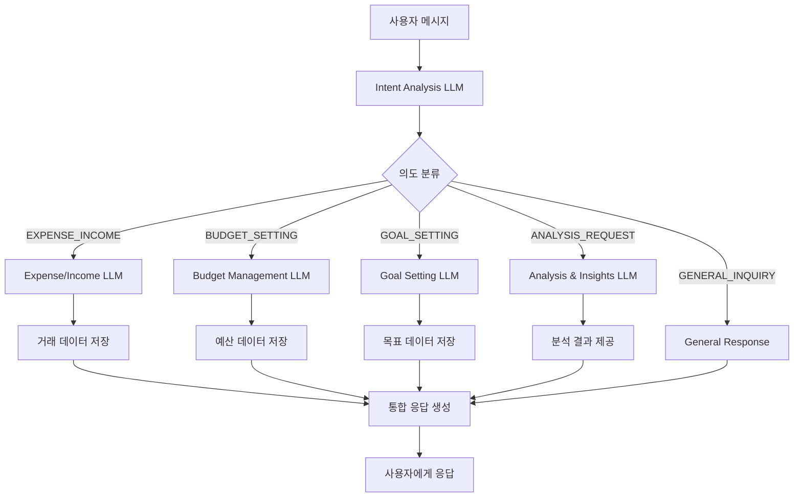

# LLM Orchestration 시스템 설계

## 현재 문제점
- 하나의 LLM이 모든 대화를 수입/지출 처리로만 분석
- 예산 설정, 목표 관리, 분석 요청 등 다양한 의도를 처리하지 못함
- 네이버 가계부처럼 예산/목표 기능이 부족

## 제안하는 아키텍처

### 1. Intent Analysis LLM (라우터)
**역할**: 사용자 메시지의 의도를 분석하여 적절한 전문 LLM으로 라우팅

**처리할 의도 분류**:
```typescript
enum UserIntent {
  EXPENSE_INCOME = 'expense_income',     // 수입/지출 기록
  BUDGET_SETTING = 'budget_setting',    // 예산 설정
  GOAL_SETTING = 'goal_setting',        // 목표 설정
  ANALYSIS_REQUEST = 'analysis_request', // 분석/통계 요청
  GENERAL_INQUIRY = 'general_inquiry',   // 일반 문의
  ACCOUNT_MANAGEMENT = 'account_management' // 계정 관리
}
```

**예시 분류**:
- "어제 스벅에서 5천원 썼어" → `EXPENSE_INCOME`
- "이번 달 식비 예산을 30만원으로 잡아줘" → `BUDGET_SETTING`
- "올해 저축 목표를 500만원으로 설정하고 싶어" → `GOAL_SETTING`
- "이번 달 지출이 얼마나 되는지 알려줘" → `ANALYSIS_REQUEST`

### 2. Specialized LLM Services

#### A. Expense/Income LLM (기존)
- **기능**: 수입/지출 데이터 파싱 및 분류
- **입력**: 자연어 거래 내역
- **출력**: 구조화된 거래 데이터 (금액, 카테고리, 날짜 등)

#### B. Budget Management LLM (신규)
- **기능**: 예산 설정, 수정, 조회
- **처리 예시**:
  - "식비 예산을 월 30만원으로 설정해줘"
  - "교통비 예산을 15만원에서 20만원으로 늘려줘"
  - "이번 달 예산 현황 알려줘"

#### C. Goal Setting LLM (신규)
- **기능**: 저축/투자 목표 설정 및 관리
- **처리 예시**:
  - "올해 저축 목표 500만원으로 설정"
  - "해외여행 자금 200만원 모으기"
  - "목표 달성률 어떻게 되는지 확인해줘"

#### D. Analysis & Insights LLM (신규)
- **기능**: 데이터 분석 및 인사이트 제공
- **처리 예시**:
  - "이번 달 지출 패턴 분석해줘"
  - "작년 같은 시기와 비교해줘"
  - "절약할 수 있는 카테고리 추천해줘"

### 3. Orchestration Flow



## 구현 계획

### Phase 1: Intent Analysis System
1. Intent Classification LLM 구현
2. 라우팅 로직 개발
3. 기존 Expense LLM과 통합

### Phase 2: Budget Management
1. 예산 데이터 모델 설계
2. Budget Management LLM 구현
3. 예산 설정/조회 UI 개발

### Phase 3: Goal Setting
1. 목표 데이터 모델 설계
2. Goal Setting LLM 구현
3. 목표 관리 UI 개발

### Phase 4: Analytics & Insights
1. 데이터 분석 엔진 구현
2. Analysis LLM 구현
3. 인사이트 대시보드 개발

## 데이터베이스 스키마 확장

### 예산 테이블 (budgets)
```sql
CREATE TABLE budgets (
    id UUID PRIMARY KEY DEFAULT uuid_generate_v4(),
    user_id UUID REFERENCES users(id) ON DELETE CASCADE,
    category_id UUID REFERENCES categories(id),
    amount DECIMAL(12,2) NOT NULL,
    period_type VARCHAR(20) NOT NULL, -- 'monthly', 'yearly'
    start_date DATE NOT NULL,
    end_date DATE,
    created_at TIMESTAMP WITH TIME ZONE DEFAULT NOW(),
    updated_at TIMESTAMP WITH TIME ZONE DEFAULT NOW()
);
```

### 목표 테이블 (goals)
```sql
CREATE TABLE goals (
    id UUID PRIMARY KEY DEFAULT uuid_generate_v4(),
    user_id UUID REFERENCES users(id) ON DELETE CASCADE,
    title VARCHAR(200) NOT NULL,
    description TEXT,
    target_amount DECIMAL(12,2) NOT NULL,
    current_amount DECIMAL(12,2) DEFAULT 0,
    target_date DATE,
    goal_type VARCHAR(50) NOT NULL, -- 'saving', 'debt_reduction', 'investment'
    status VARCHAR(20) DEFAULT 'active', -- 'active', 'completed', 'paused'
    created_at TIMESTAMP WITH TIME ZONE DEFAULT NOW(),
    updated_at TIMESTAMP WITH TIME ZONE DEFAULT NOW()
);
```

## API 엔드포인트 설계

### Intent Analysis
- `POST /api/chat/analyze-intent`
- `POST /api/chat/orchestrate`

### Budget Management
- `GET /api/budgets`
- `POST /api/budgets`
- `PUT /api/budgets/:id`
- `DELETE /api/budgets/:id`

### Goal Management
- `GET /api/goals`
- `POST /api/goals`
- `PUT /api/goals/:id`
- `DELETE /api/goals/:id`

## 예상 효과

1. **사용자 경험 향상**
   - 다양한 금융 관리 의도를 자연어로 처리
   - 더 포괄적인 가계부 기능 제공

2. **기능 확장성**
   - 새로운 의도 유형 쉽게 추가 가능
   - 전문화된 LLM으로 더 정확한 처리

3. **네이버 가계부 수준 기능**
   - 예산 관리
   - 목표 설정 및 추적
   - 데이터 기반 인사이트

## 구현 우선순위

1. **High**: Intent Analysis + Budget Management
2. **Medium**: Goal Setting
3. **Low**: Advanced Analytics & Insights

이 시스템을 통해 단순한 수입/지출 기록을 넘어선 종합적인 개인 금융 관리 도구로 발전할 수 있습니다.