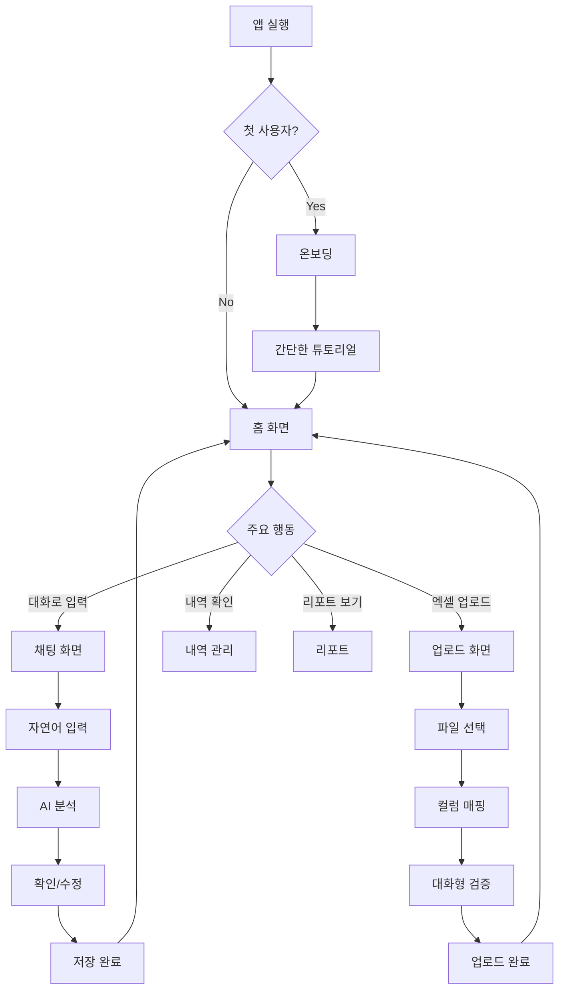
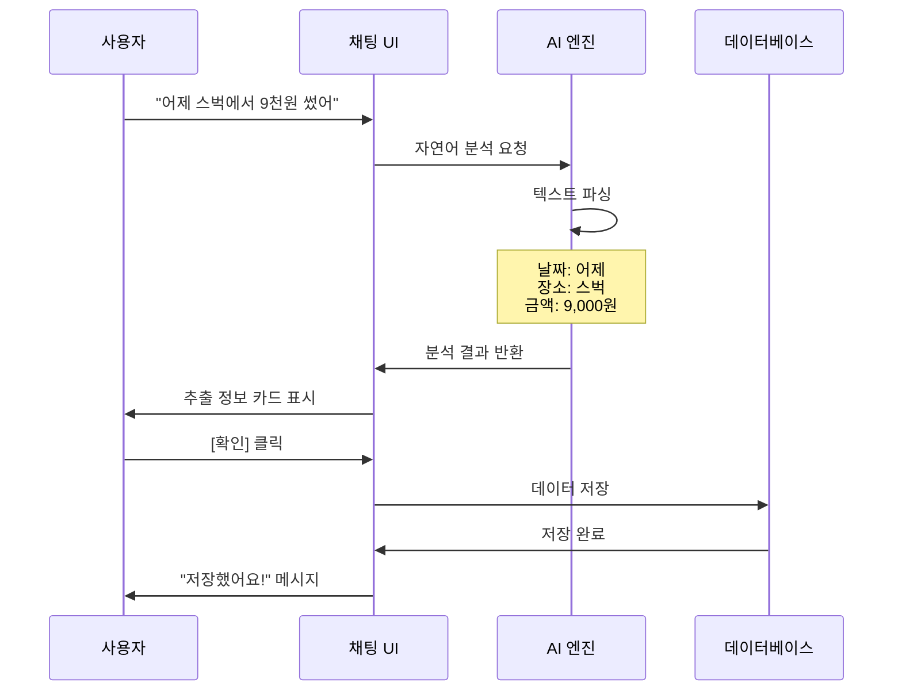
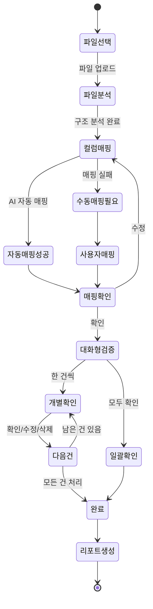
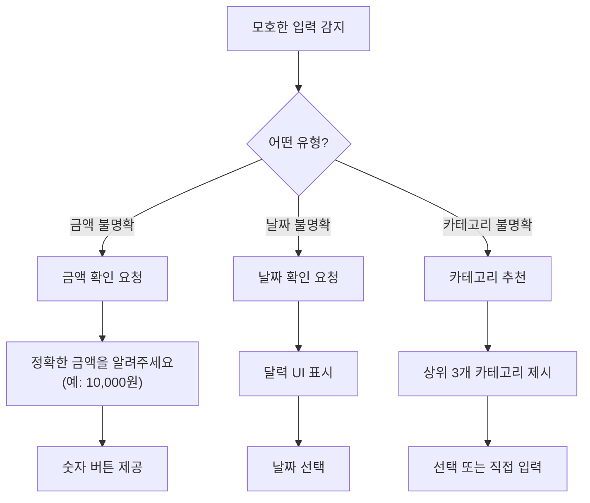
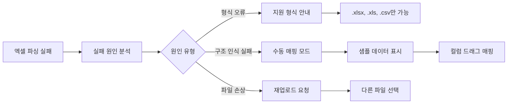
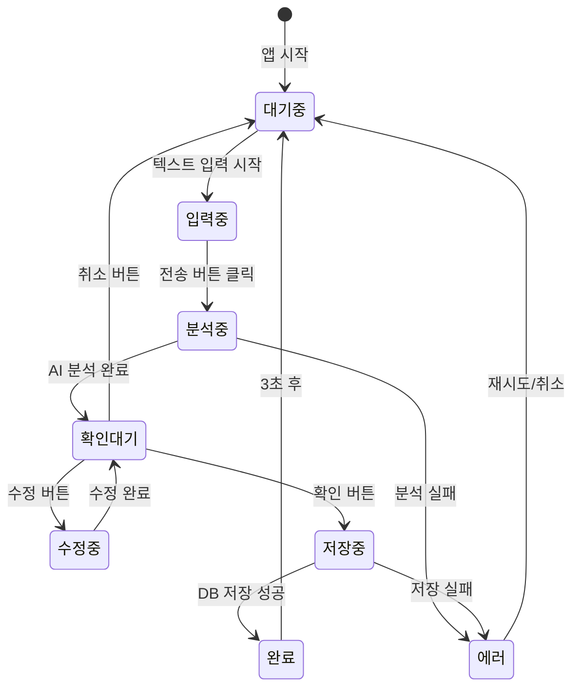
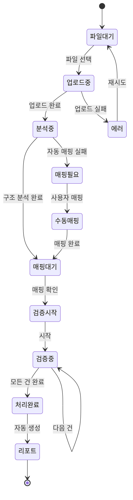

# 머니챗(MoneyChat) 사용자 플로우 다이어그램

## 1. 주요 사용자 플로우 맵

### 1.1 전체 사용자 여정 (User Journey Map)



### 1.2 대화형 입력 상세 플로우



### 1.3 엑셀 업로드 플로우



## 2. 핵심 인터랙션 플로우

### 2.1 자연어 수정 플로우

```
사용자: "어제 스벅에서 9천원 썼어"
AI: [카드 UI - 날짜: 어제, 장소: 스타벅스, 금액: 9,000원]
사용자: "아니야, 8천원이었어"
AI: [수정된 카드 UI - 금액: 8,000원으로 변경됨]
사용자: [확인]
AI: "수정해서 저장했어요!"
```

### 2.2 복수 내역 처리 플로우

```
사용자: "오늘 점심 15000원, 교통비 3200원, 저녁 치킨 25000원"

AI: "3건의 지출을 찾았어요. 하나씩 확인해주세요."

[카드 1/3]
- 날짜: 오늘
- 카테고리: 식비(점심)
- 금액: 15,000원
[확인] [수정]

[카드 2/3]
- 날짜: 오늘
- 카테고리: 교통비
- 금액: 3,200원
[확인] [수정]

[카드 3/3]
- 날짜: 오늘
- 카테고리: 식비(저녁)
- 금액: 25,000원
- 메모: 치킨
[확인] [수정]

[모두 확인하기]
```

### 2.3 상대적 시간 인식 플로우

```
지원되는 표현:
- "오늘" → 2025-07-29
- "어제" → 2025-07-28
- "그저께" → 2025-07-27
- "3일 전" → 2025-07-26
- "지난 주 월요일" → 2025-07-22
- "이번 달 초" → 2025-07-01~03
- "지난 달 말" → 2025-06-28~30
```

## 3. 에러 상황별 처리 플로우

### 3.1 모호한 입력 처리



### 3.2 중복 감지 플로우

```
IF (동일시간대 AND 동일금액) THEN
    AI: "비슷한 내역이 있어요"
    
    [기존 내역 표시]
    - 2025-07-29 14:30
    - 스타벅스
    - 9,000원
    
    "이 내역과 같은 건가요?"
    [같은 내역] [다른 내역] [취소]
END IF
```

### 3.3 엑셀 파싱 실패 처리



## 4. 상태 전이 다이어그램

### 4.1 채팅 입력 상태



### 4.2 엑셀 업로드 상태



## 5. 화면 전환 플로우

### 5.1 메인 네비게이션 플로우

```
홈 화면
├─→ 채팅 (하단 + 버튼)
├─→ 엑셀 업로드 (홈 카드)
├─→ 내역 관리 (하단 탭)
├─→ 리포트 (하단 탭)
└─→ 설정 (프로필)

채팅 화면
├─→ 홈 (뒤로 버튼)
├─→ 내역 상세 (저장된 내역 클릭)
└─→ 설정 (우측 상단)

엑셀 업로드
├─→ 파일 선택
├─→ 매핑 확인
├─→ 대화형 검증
├─→ 완료 리포트
└─→ 홈 (완료 후)
```

### 5.2 딥링크 구조

```
moneychat://
├── home (홈 화면)
├── chat (채팅 화면)
│   └── chat/new (새 대화 시작)
├── upload (엑셀 업로드)
├── history (내역 관리)
│   ├── history/detail/{id} (상세 보기)
│   └── history/search (검색)
├── report (리포트)
│   ├── report/monthly (월별)
│   └── report/category (카테고리별)
└── settings (설정)
    ├── settings/profile
    ├── settings/category
    └── settings/export
```

## 6. 접근성 고려사항

### 6.1 스크린 리더 지원
- 모든 버튼과 인터랙티브 요소에 명확한 라벨
- 채팅 메시지 읽기 순서 최적화
- 상태 변경 시 음성 안내

### 6.2 키보드 네비게이션
- Tab 키로 모든 요소 접근 가능
- Enter 키로 기본 동작 실행
- Esc 키로 모달/팝업 닫기

### 6.3 시각적 피드백
- 고대비 모드 지원
- 색맹 사용자를 위한 아이콘 병용
- 충분한 터치 영역 확보 (최소 44x44px)

---

이 플로우 다이어그램은 머니챗의 핵심 사용자 경험을 시각화한 것입니다.
대화형 인터페이스를 통해 복잡한 가계부 작성을 단순하고 직관적으로 만드는 것이 
설계의 핵심 목표입니다.